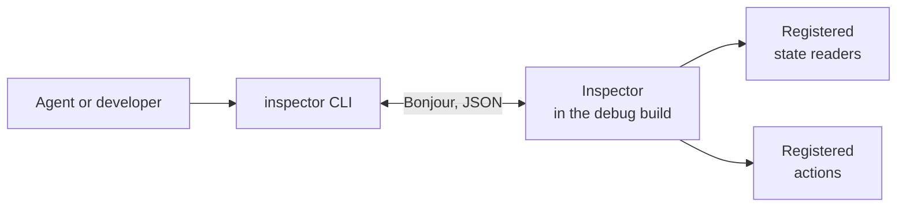

# inspector

Read the state of a running macOS or iOS app and steer it from the command line.

## Why inspector?

- **Reach deep screens**: An agent sends the actions that lead to a screen instead of tapping through the UI, then reads what that screen shows as JSON.
- **Built for agents**: Every answer is one JSON document, every rejection carries a machine-readable `code`, and the whole protocol is four operations.
- **Actions are data**: The app registers state readers and actions at runtime. A new action needs no CLI code and no new message type.
- **No dependencies**: Foundation and Network.framework only, compiled into debug builds.

Tests and logs show the code, and a screenshot shows pixels. Neither lets an agent read the state behind a screen deep inside the app; `inspector` does, and keeps the screenshot as the fallback for what the state doesn't cover.

## Example

The app registers a state reader and an action, here from `demo-host`:

```swift
let inspector = Inspector.shared
inspector.state("counter") { await counter.value }
inspector.action("counter.set") { (value: Int) in await counter.set(value) }
try await inspector.serve(app: "DemoHost")
```

The CLI sends the action and answers with what changed:

```console
$ inspector send counter.set 42
{"diff":[{"new":42,"old":0,"path":"counter"}],"settled":true,"state":{"counter":42,"device":{…}}}
```

**More examples**: [The CLI](#the-cli) • [Register state and actions](#register-state-and-actions) • [`demo-host`](Sources/demo-host/main.swift)

## Quick Start

1. **Add the package** to the app or feature package:
   ```swift
   .package(url: "https://github.com/JulianKahnert/inspector", branch: "main")
   ```
   and `InspectorKit` to the target's dependencies.

2. **Register state and actions** where the state lives, usually in a view model's init ([details](#register-state-and-actions)).

3. **Serve** from a debug build ([details](#serve)):
   ```swift
   #if DEBUG
   Task { try? await Inspector.shared.serve() }
   #endif
   ```

4. **Declare Bonjour on iOS**: add `_inspector._tcp` to `NSBonjourServices` and give an `NSLocalNetworkUsageDescription` in the app's `Info.plist`.

5. **Run the CLI** while the app runs:
   ```sh
   swift build --product inspector
   .build/debug/inspector hello
   .build/debug/inspector catalog
   ```

No app at hand? `swift run demo-host` starts a fake one on the Mac.

## Architecture



**Four operations**: `hello`, `catalog`, `state` and `send`. Actions and their payload schemas travel as catalog data.

### Two protocols

- `Inspectable` is what can be inspected: a name, a catalog, the state as JSON, and `perform` for one action. `Inspector` is the built-in conformer; a framework adapter is another one, and the CLI and the wire protocol stay the same.
- `InspectorTransport` carries a `Request` to the app and its `Response` back. `BonjourTransport` is the one this package ships.

## Project Structure

- `Sources/InspectorKit/` - `Inspector`, the protocol types and the transports
- `Sources/inspector/` - The CLI
- `Sources/demo-host/` - A fake app on the Mac for manual checks
- `Tests/InspectorKitTests/` - In-process tests, no sockets
- `.claude/skills/inspector/` - The Claude Code skill for driving a running app

## The CLI

```
inspector [--app name] apps | hello | catalog | state [path] | send <path> [json]
```

Against `demo-host`:

```console
$ inspector apps
[{"app":"DemoHost","live":true,"name":"…","pid":39817,"provider":"Inspector"}]

$ inspector hello
{"app":"DemoHost","pid":39817,"provider":"Inspector"}

$ inspector catalog
{"actions":[{"path":"counter.increment"},{"path":"counter.set","payload":{"kind":"int"}}]}

$ inspector state
{"counter":0,"device":{"name":"…","pid":"39817"}}

$ inspector send counter.set 42
{"diff":[{"new":42,"old":0,"path":"counter"}],"settled":true,"state":{"counter":42,"device":{…}}}

$ inspector send counter.set abc
{"code":"PAYLOAD_TYPE_MISMATCH","message":"expected integer, got string"}

$ inspector send counter.sett
{"code":"UNKNOWN_ACTION_PATH","didYouMean":["counter.increment","counter.set"],"message":"no action at `counter.sett`"}

$ inspector send counter.increment
{"diff":[{"new":43,"old":42,"path":"counter"}],"settled":true,"state":{"counter":43,"device":{…}}}

```

- **Several apps**: `inspector apps` lists every serving app and checks each with `hello`; an app that does not answer is listed with `"live":false`. Apps advertise as `<app> @ <device>`. With more than one app serving, every other command fails with `AMBIGUOUS_APP` until `--app` picks one by that name or its `<app>` part. With none, it fails with `APP_NOT_FOUND` after 5 seconds.
- **Stable output**: Keys are sorted, so two answers with the same content are byte-identical.
- **Errors**: A rejection goes to stderr as one JSON line and the CLI exits with 1. Branch on `code`, never on `message`.
- **`didYouMean`**: For an unknown action path, lists the registered paths that share its last segment or its prefix.
- **Payloads**: A `send` payload is parsed as JSON; anything that does not parse is sent as a string.

## Debugging a running app with an agent

Claude Code gets this loop as the `inspector` skill in `.claude/skills/inspector/`, with scripts for each step. The app runs a debug build that registers state and actions and calls `serve()`.

1. **Build the CLI once**, then call the binary directly. That skips the `swift run` check on every call, and one call then takes about 20–100 ms. Every call is bounded: without a serving app the CLI fails with `APP_NOT_FOUND` after 5 seconds, and an app that stops answering ends in `TIMEOUT`.

2. **Find out what is connected and what it offers.**
   - `dns-sd -B _inspector._tcp` lists every serving app under its device name. An app in the simulator advertises under the Mac's name.
   - `inspector hello` names the app that answered, and its pid. The CLI connects to the first app it finds, so with several running, check `hello` before anything else.
   - `inspector catalog` lists the actions with their payload schema, `inspector state` returns every registered state reader. Both grow as you navigate: a screen registers its readers and actions when its model is created, so a screen that has not been opened yet is missing.

3. **Navigate to the screen** with one `send` per step. After each step that pushes a screen or presents a sheet, poll `inspector state` until that screen's key appears before you send the next action. It usually takes 100–200 ms. A `send` answer can come back with an empty `diff` even when a screen opened, because that screen registers its state only after the action has settled.

4. **Read the answer from the state.** `inspector state` gives the whole document, and every `send` answer carries the `diff` it caused. The path in `inspector state <path>` is split at every dot, so a top-level key that itself contains a dot, such as `chat.draft`, is only reachable through the whole document: filter it locally, for example with `jq '."chat.draft"'`.

5. **Take a screenshot only when the state can't answer**: a step fails without the state saying why, or the question is visual. A screenshot costs an agent far more time and tokens than the same facts as JSON.

   ```sh
   xcrun simctl io booted screenshot screen.png    # iOS simulator; a UDID instead of `booted` picks one of several
   ```

   If the screenshot showed something the task needed, add it to that screen's registered state, so the next run reads it as JSON instead.

## Integrating from an app or a feature package

### Register state and actions

Register where the state lives, typically in a view model's or a feature state's init, and keep the tokens:

```swift
import InspectorKit

@MainActor
final class ChatViewModel {
  var draft = ""
  private var registrations: [Registration] = []

  init() {
    registrations.append(Inspector.shared.state("chat.draft") { @MainActor [weak self] in
      self?.draft ?? ""
    })
    registrations.append(Inspector.shared.action("chat.draft.set") { @MainActor [weak self] (text: String) in
      self?.draft = text
    })
  }

  deinit {
    registrations.forEach { $0.cancel() }
  }
}
```

`cancel()` removes a registration. Registering the same key or path again replaces the previous entry, and cancelling the older token leaves the newer one in place, so a second instance of the same screen takes over instead of crashing the app. A dropped token keeps the registration for the inspector's lifetime.

### Declare the payload schema

The payload's JSON shape is derived from the closure's parameter type: `Int` becomes `{"kind":"int"}`, `Int?` becomes `{"kind":"optional","of":{"kind":"int"}}`, and a `Codable` type without a `SchemaDescribable` conformance becomes `{"kind":"decodable","type":"…"}`. An explicit `schema:` wins:

```swift
Inspector.shared.action("plan.set", schema: .enumeration(values: ["free", "pro"])) { (plan: String) in
  await store.setPlan(plan)
}
```

### Serve

Start serving anywhere, once the app runs:

```swift
import OSLog

#if DEBUG
Task {
  do {
    try await Inspector.shared.serve()
  } catch {
    Logger().error("inspector stopped serving: \(error)")
  }
}
#endif
```

`serve()` is idempotent: while one call serves, a second returns at once. A feature package and its host app may both call it, and a host app that does not call it gets the package's server anyway. `serve()` advertises over Bonjour under the device's name; `serve(app:over:)` takes any transport.

On iOS, declare `_inspector._tcp` in the app's `NSBonjourServices` and give an `NSLocalNetworkUsageDescription`. On the Mac, the first browse from the CLI asks once for local network access.

## Development

```sh
swift build && swift test
```

The tests run against `Inspector` and the request handler directly, or through an in-memory transport; none opens a socket. `BonjourTransport` has no automated test, so check it by hand with two terminals:

```sh
swift run demo-host                  # terminal 1
swift run inspector hello            # terminal 2
swift run inspector send counter.set 42
```

## References

- [Native is now the future of mobile at Shopify](https://shopify.engineering/back-to-native) - Shopify Engineering, the inspiration for this package
